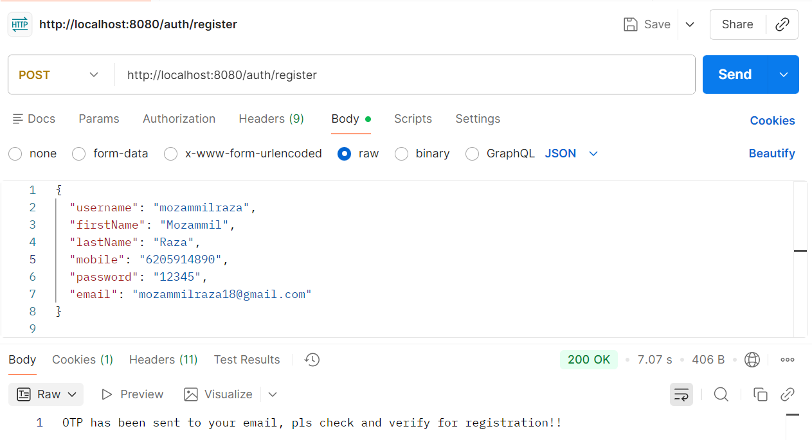
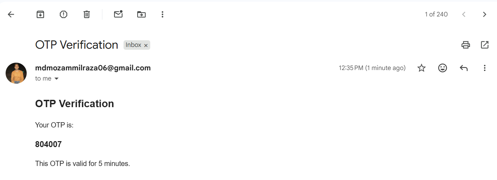
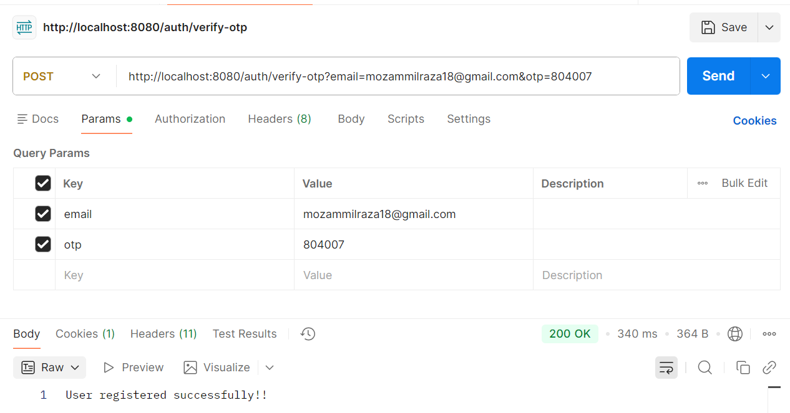
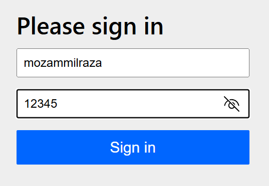
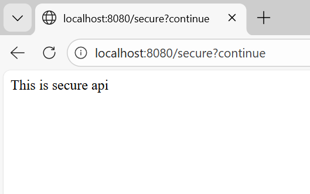

# otp-auth-app

## 1. User Registration and Verification using OTP through Email

### Registration
- Check user exists or not
- Check email exists or not
- Save the user but set `enabled = false` initially
- There is one table for OTP Verification where all fields are stored  
  with the generated **encrypted OTP**, OTP lifetime as **5 minutes**,  
  and `verified = false` at first
- Call the `sendOtp` method where email OTP sending logic is written  
  and send OTP to the registered email






### Verification
- There is a `verifyOtp` method written for the verification purpose
- Check in the `otp_verification` table whether email and OTP are present or not
- If OTP and email are present, check whether the OTP is expired or not
- If not expired, set the `verified` field as `true`
- From the user table, check whether the email is present or not
- If present, set the `enabled` field as `true`



### Now you can Login

```json
@Bean
    public SecurityFilterChain filterChain (HttpSecurity http)
    {
        http.csrf(csrf -> csrf.disable())
                .formLogin(Customizer.withDefaults())
                .authorizeHttpRequests(auth ->
                        auth.requestMatchers("/auth/register", "/public",
                                        "/auth/verify-otp").permitAll()
                                .anyRequest().authenticated());

        return http.build();
    }
```
Expect /auth/register", "/public","/auth/verify-otp" all endpoints are Authenticated.



We will write the correct credential for the specific user and login.



Now you can see that user can successful logged in.

---
Created by **Mozammil Raza**